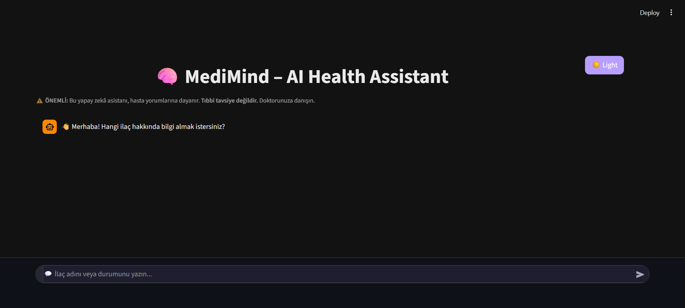
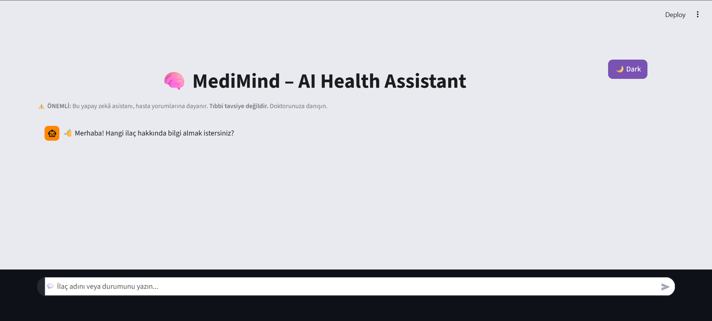
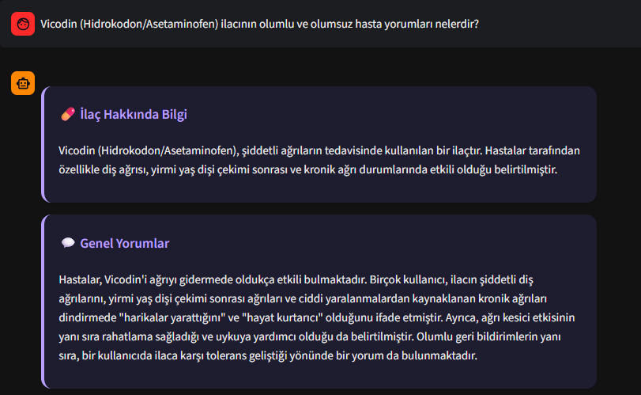
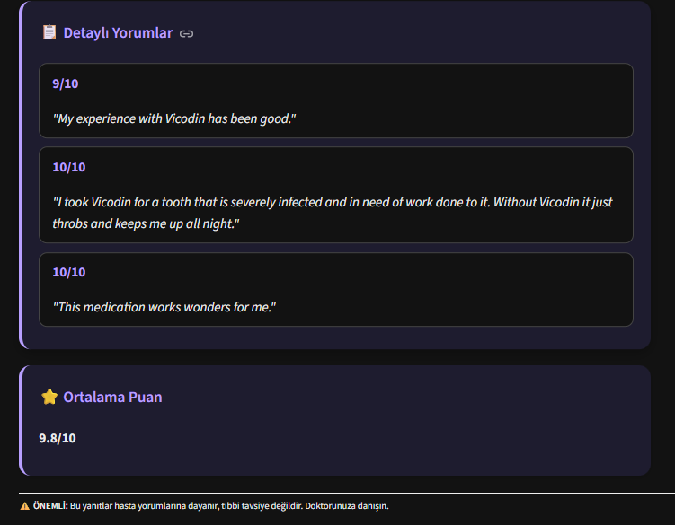
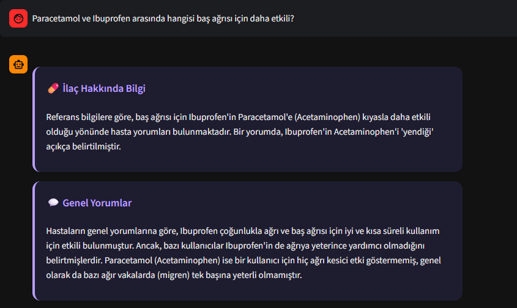
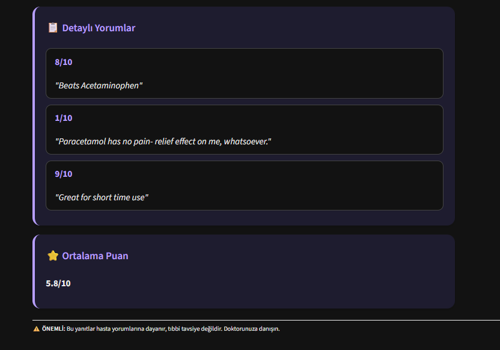
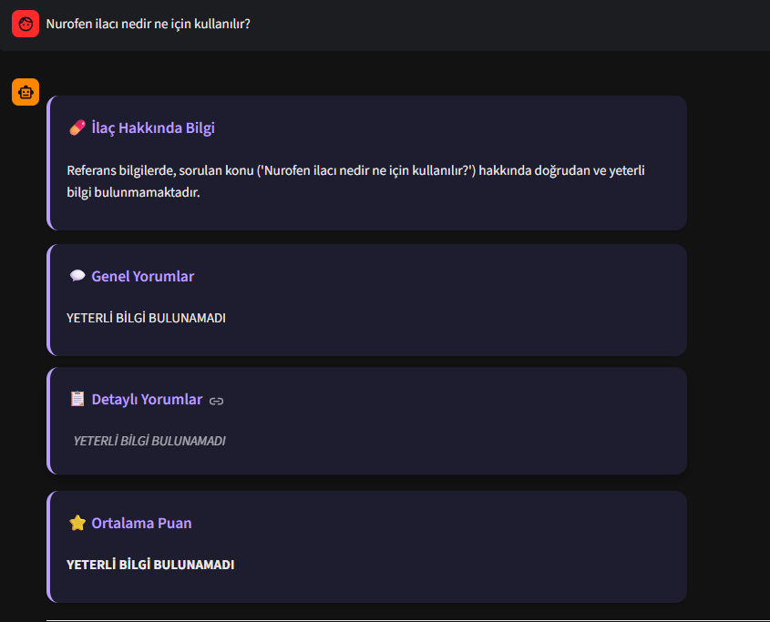

# 🧠 MediMind – Hasta Yorumu RAG Bilgi Asistanı
Bu proje, Akbank & Global AI Hub tarafından düzenlenen GenAI Bootcamp'in bitirme projesi olarak geliştirilmiştir. Projenin ana hedefi, hasta deneyimine dayalı spesifik soruları güvenilir ve yapılandırılmış bir formatta yanıtlayan bir RAG chatbot'u dağıtmaktır.

---

## 1. Projenin Amacı 
Bu projenin temel amacı, Retrieval Augmented Generation (RAG) mimarisinin gücünden yararlanarak, kullanıcılara ilaç ve sağlık durumları hakkında doğrudan hasta deneyimlerine dayalı, güvenilir ve yapılandırılmış bilgi sunan yenilikçi bir bilgi asistanı oluşturmaktır.

Proje, yalnızca sohbet etmek yerine, kritik bilgileri doğru kaynaktan çekmeye odaklanır:
Güvenilirlik ve Halüsinasyon Kontrolü: Sistem, iki kademeli bir doğrulama mekanizması kullanır:
Eğer soru, hasta deneyimine (yorum/puan) dair ise, cevaplar yalnızca ChromaDB'deki verilerden çekilir.
Eğer soru, genel tıbbi sınıflandırma veya etken madde bilgisi gerektiriyorsa (Örn: "Benzer ilaçlar nelerdir?"), Gemini'nin Google Search Tool'u devreye girer. 
Bu hibrit yaklaşım, Gemini'nin kendi kendine bilgi uydurma (halüsinasyon) riskini en aza indirir.

Yapılandırılmış ve Anlaşılır Çıktı (Structured Output): Üretilen yanıtlar, karmaşık metin blokları halinde sunulmak yerine, kullanıcı deneyimini maksimize eden özel bir formata dönüştürülür. 
Bu format; ilacın kullanım amacını, hastaların ortalama puanını, genel memnuniyet özetini ve bilgiyi destekleyen detaylı kaynak yorumlarını içeren özel HTML/JSON yapısında sunulur.

---

## 2. Veri Seti Hakkında Bilgi
Projede, RAG sisteminin bel kemiğini oluşturan, gerçek kullanıcı deneyimlerini içeren büyük bir ilaç yorumları veri seti kullanılmıştır.
Kaynak: Halka açık platformlardan toplanmış drugs.com hasta yorumları veri seti (drugsComTrain_raw.csv ve drugsComTest_raw.csv).

Hazırlık Süreci: Veri setindeki yorumlar birleştirilmiş, temizlenmiş ve her bir satır, ilaç adı, kullanım durumu ve puan bilgisini içerecek şekilde tek bir "passage" (metin bloğu) haline getirilmiştir. Bu yapı, ChromaDB'ye yüklenmeye hazır hale getirilmiştir.
İşlenen İçerik: Veri setinin tamamı, 215.000'den fazla benzersiz hasta deneyimi ve yorumunu içerir.

---

## 3. Kullanılan Yöntemler ve Çözüm Mimarisi
Proje, RAG mimarisi temel alınarak geliştirilmiş olup, genel sorular için akıllı araç kullanımına sahiptir.

RAG Akış Şeması (Hibrit ve Karar Odaklı):
```
[Kullanıcı Sorusu] -> [Soru Analizi (RAG/Tool)] -> [Sorgu Genişletme (Örn: Accutane)] -> [Vektör Arama (ChromaDB) VEYA Google Search Tool] -> [(Context + Soru) -> Gemini Modeli] -> [Yapılandırılmış Cevap]
```

** Kullanılan Teknolojiler: **

* **Veri Yönetimi : **Pandas
* **Embedding Modeli :** `sentence-transformers` (`all-MiniLM-L6-v2`)
* **Vektör Veritabanı :** ChromaDB
* **Generation & Tools :** Google Gemini API (`gemini-2.5-flash`) ve Google Search Tool
* **Arayüz:** Streamlit
* **Deployment:** Streamlit Community Cloud
* **Dil:** Python

<p align="center">
  
  
  
  
  
</p>

---

## 4. Web Arayüzü & Çalıştırma Kılavuzu 


### 🖼️ Elde Edilen Sonuçların ve Arayüzün Kanıtları

Aşağıdaki görseller, projenin farklı fonksiyonlarının (RAG, Google Tool ve Halüsinasyon Kontrolü) başarılı çıktısını göstermektedir:

#### Fonksiyonel Çıktılar ve Başarı Kanıtları:

| Sıra | Açıklama | Görsel |
| :---: | :--- | :--- |
| **1** | **Ana Sayfa / Dark Mode** |  |
| **2** | **Ana Sayfa / Light Mode** |  |
| **3** | **Spesifik İlaç Analizi (Başarılı Sorgu)** |  |
| **4** | **Detaylı İlaç Değerlendirmesi** |  |
| **5** | **İlaç Karşılaştırma Analizi** |  |
| **6** | **Karşılaştırmanın Detaylı Değerlendirmesi** |  |
| **7** | **Halüsinasyon Kontrolü (Yetersiz Bilgi)** |  |

---
